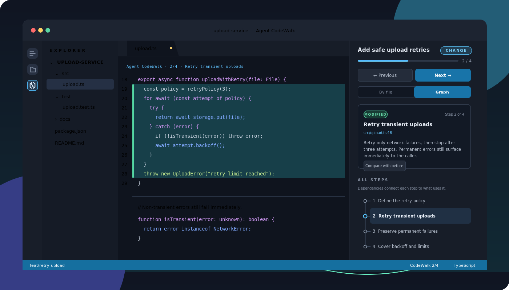

<p align="center">
  
</p>

<h1 align="center">Agent CodeWalk</h1>

<p align="center">
  Turn an AI agent's work into a guided tour of the code—one meaningful block at a time.
</p>

<p align="center">
  <a href="README.md">English</a> ·
  <a href="README.zh-CN.md">简体中文</a>
</p>

<p align="center">
  <a href="https://marketplace.visualstudio.com/items?itemName=agent-codewalk.agent-codewalk"></a>
  <a href="https://open-vsx.org/extension/agent-codewalk/agent-codewalk"></a>
  <a href="https://github.com/andylin-hao/agent-codewalk/releases/latest"></a>
  <a href="https://github.com/andylin-hao/agent-codewalk/actions/workflows/ci.yml"></a>
  <a href="LICENSE"></a>
</p>



Coding agents are good at making changes. Understanding those changes can still mean
chasing file names through a chat transcript, reconstructing execution order, and
guessing which lines an explanation refers to. Agent CodeWalk puts that missing layer
inside your editor.

After Codex, Claude Code, or OpenCode finishes, Agent CodeWalk opens the relevant file,
highlights the exact block, and explains what changed, why it changed, and what depends
on it. Ask a question instead of requesting an edit and it can publish the same kind of
navigable tour through existing code—without changing a file.

No second model, cloud service, or API key is required. The agent you already use writes
the walkthrough, and the extension keeps the baseline, explanations, and session data on
your machine.

## Why Agent CodeWalk?

- **Read the story, not a file list.** Follow execution flow as a dependency graph, or
  switch to a complete view grouped by file.
- **Stay anchored in real code.** Each step opens the source and highlights the block it
  describes. CodeLens and the status bar keep navigation close at hand.
- **See what actually changed.** Added, modified, deleted, renamed, and contextual blocks
  are visually distinct, with a focused before/after comparison when baseline text is
  available.
- **Trust the coverage.** For a normal change walkthrough, the local companion refuses to
  publish until every text diff hunk is covered by at least one step.
- **Keep control of your machine.** Setup previews every user-level file it will touch,
  creates backups, rolls back failed installs, and never overwrites integrations it does
  not own.
- **Use the agent and editor you prefer.** Codex, Claude Code, and OpenCode are supported
  in desktop VS Code, Cursor, VSCodium, and compatible desktop builds.

## Install

Marketplace installation is recommended because it provides the simplest update path.

### Visual Studio Marketplace

Install [Agent CodeWalk from the Visual Studio Marketplace](https://marketplace.visualstudio.com/items?itemName=agent-codewalk.agent-codewalk),
search for **Agent CodeWalk** in the Extensions view, or use the command line:

```bash
code --install-extension agent-codewalk.agent-codewalk
```

Cursor users can install the same listing from the Extensions view or run:

```bash
cursor --install-extension agent-codewalk.agent-codewalk
```

### Open VSX Registry

For VSCodium and editors backed by Open VSX, install
[Agent CodeWalk from Open VSX](https://open-vsx.org/extension/agent-codewalk/agent-codewalk)
or search for **Agent CodeWalk** in the editor's Extensions view.

```bash
codium --install-extension agent-codewalk.agent-codewalk
```

### GitHub Releases

Every tagged release also publishes platform-specific VSIX files and a `SHA256SUMS` file
on [GitHub Releases](https://github.com/andylin-hao/agent-codewalk/releases). Download
the package matching the machine that runs the extension host:

| Platform | Release asset |
| --- | --- |
| Linux x64, including most Remote SSH hosts | `agent-codewalk-linux-x64.vsix` |
| Windows x64 | `agent-codewalk-win32-x64.vsix` |
| macOS Intel | `agent-codewalk-darwin-x64.vsix` |
| macOS Apple silicon | `agent-codewalk-darwin-arm64.vsix` |

Install the downloaded file from **Extensions: Install from VSIX...** or from a terminal:

```bash
code --install-extension ./agent-codewalk-linux-x64.vsix
```

VSIX installs do not follow the normal Marketplace auto-update path. Use a store listing
unless you specifically need an offline or pinned installation.

## Set up your agent

Installing the editor extension is only the first half. The one-time setup command adds
the bundled local MCP companion and portable skill to the agents already installed on
your machine.

1. Open the Command Palette and run **Agent CodeWalk: Setup Agent Integrations**.
2. Review the confirmation. It names the companion destination and every user-level
   configuration, skill, or lifecycle-hook file that may change.
3. Choose **Install**. Each updated configuration is backed up, and a failed agent setup
   is rolled back without undoing successful integrations for other agents.
4. Restart any running Codex, Claude Code, or OpenCode session. An existing session keeps
   the companion process it started with and cannot see a newly installed version.
5. Run **Agent CodeWalk: Diagnose Installation** if you want to confirm that each agent
   actually lists `agent-codewalk`, rather than merely checking that a config file exists.

Setup only configures agents it detects. Install your preferred agent first, then rerun
the setup command whenever you add another one.

## Use it

Work with your agent normally; you do not need a special prompt.

### Walk through a change

Ask the agent to implement, fix, refactor, or document something. Immediately before its
first file edit, the Agent CodeWalk skill records a lightweight baseline. After the agent
verifies its work, it publishes a walkthrough whose steps collectively cover every text
change.

Example prompts:

```text
Add retry handling to the upload path and test the failure cases.
Refactor the authentication middleware so the request flow is easier to follow.
Update the CLI help and the user documentation together.
```

### Walk through existing code

Ask the agent to analyze, explain, review, or trace code. It publishes an explanation
walkthrough directly—no baseline or file edit is needed.

```text
Explain how a published walkthrough reaches the sidebar.
Trace the integration setup from the command to the config files it owns.
Review the stale-anchor handling and show me where it fails safely.
```

Questions that do not point at code, such as general configuration advice, stay in the
chat and do not create an unnecessary walkthrough.

## Read a walkthrough

Accept the publication notification, or run **Agent CodeWalk: Open Latest Walkthrough**.
Either opens the walkthrough and reveals a panel, so neither depends on finding an icon
first.

Agent CodeWalk is offered from both sides, and the two show the same step because they
share one session:

- The **Activity Bar** on the left, beside your other extensions.
- The **Secondary Side Bar** on the right, beside the agent that produced the walkthrough,
  which is where a walkthrough is usually most useful.

### Opening the Secondary Side Bar

**VS Code keeps that bar hidden until you open it**, and a hidden bar has no container
switcher, so there is no strip for any icon to be in. That is the usual reason the icon
seems to be missing. Any of these opens it:

- `Ctrl+Alt+B`, or `Cmd+Alt+B` on macOS.
- **View → Appearance → Secondary Side Bar**.
- **View: Toggle Secondary Side Bar Visibility** from the Command Palette.

Once it is open, the Agent CodeWalk icon appears in the switcher along its top edge.
VS Code remembers layout changes, so **View: Reset View Locations** restores the defaults
if a container was dragged elsewhere.

| Action | Shortcut | Command |
| --- | --- | --- |
| Next visible step | `Alt+]` | **Agent CodeWalk: Next Step** |
| Previous visible step | `Alt+[` | **Agent CodeWalk: Previous Step** |
| Switch between graph and file views | `Alt+\` | **Agent CodeWalk: Switch Between Graph and File Views** |
| Jump to any step | `Ctrl+Alt+W` (`Cmd+Alt+W` on macOS) | **Agent CodeWalk: Jump to Step** |
| Compare with the replaced code | — | **Agent CodeWalk: Compare Current Step With Before** |

The graph starts with a small set of high-level steps. Expand a step to reveal its
details; dependency lanes connect it to the steps that rely on it. The file view shows
the same walkthrough grouped by source file. Selecting a step from the graph, file list,
CodeLens, status bar, or search always opens the same anchored block in the editor.

The interface follows the editor language and currently includes English and Simplified
Chinese.

## Change and explanation walkthroughs

| | Change | Explanation |
| --- | --- | --- |
| Best for | Work that modified files | Analysis, review, and code tours |
| Publication path | `begin_task` → `publish_walkthrough` | `publish_explanation` |
| Git baseline | Required for complete coverage | Not used |
| Validation | Every text diff hunk must be explained | Every step must point at current code |
| Highlight | Add, modify, delete, rename, or context | Neutral context |
| Before/after diff | Available when text was replaced | Not applicable |

A change walkthrough can include unchanged context when the reader needs to see a caller,
contract, or dependency to understand the edit. Those steps use a quieter neutral
highlight so they are never mistaken for changes.

## Local-first by design

Agent CodeWalk has no telemetry, makes no network requests, and does not call a model API.
The only network activity in the normal lifecycle comes from your editor installing or
updating the extension through the distribution channel you chose.

The Rust companion communicates with the agent over standard input/output and never
opens a listening port. Sessions store paths, explanations, line ranges, code hashes,
and up to 4,000 characters of replaced text per step for comparison; they do not copy
entire source files. Workspace traversal, absolute paths, and symlink escapes are rejected
at publication boundaries.

See [Security](SECURITY.md) for the threat model and reporting process, and
[Architecture](docs/architecture.md) for the full data flow.

## Settings

Most users do not need to change these values.

### When a walkthrough is produced

`agentCodeWalk.trigger` chooses between two ways of working:

- **`auto`** (default) — the agent records a baseline before its first edit and publishes
  a walkthrough once it has verified the work. Every code change gets one.
- **`manual`** — the agent publishes only when you ask. Nothing is recorded before an
  edit unless you asked beforehand; if you ask afterwards, the walkthrough is marked as
  having a degraded baseline because it can only infer what changed from the repository's
  current state.

Asking an agent to explain existing code works the same in both modes, since that is
already a request.

The setting is written to the companion's data directory, which is the only thing the
editor and an agent-started companion share. The prompt reminder and the stop hook see a
change immediately; the instructions an agent is given are sent once per session, so
restart an active session to change how it behaves.

| Setting | Default | Purpose |
| --- | --- | --- |
| `agentCodeWalk.trigger` | `auto` | Whether a walkthrough is published after every code change, or only when you ask |
| `agentCodeWalk.initialDepth` | `2` | Number of nested levels expanded when a walkthrough opens |
| `agentCodeWalk.notifyOnPublish` | `true` | Show a notification when a new walkthrough arrives |
| `agentCodeWalk.refreshInterval` | `4000` | Fallback polling interval in milliseconds when file watching is unavailable |
| `agentCodeWalk.storagePath` | Platform data directory | Override where local sessions and the installed companion are stored |
| `agentCodeWalk.companionPath` | Bundled binary | Use a locally built companion during development or diagnosis |

`AGENT_CODEWALK_HOME` overrides the data directory for both the extension and companion.
`AGENT_CODEWALK_WORKSPACE` overrides the workspace root used by the companion.

## Compatibility and current limits

- Desktop VS Code 1.106 or newer is required for the Secondary Side Bar container.
  Cursor, VSCodium, Remote SSH, and WSL are supported when they provide a compatible
  desktop extension host.
- Browser-hosted editors cannot launch the local companion.
- Binary files, Git submodules, generated files, non-UTF-8 files, and files larger than
  1 MiB are listed as excluded changes instead of being rendered as code steps.
- A fully deleted file has no current block to highlight; its explanation remains visible
  and the target is marked unavailable.
- If code moves after publication, Agent CodeWalk relocates it only when one unique hash
  match exists. Otherwise it reports the step as stale instead of highlighting the wrong
  code.
- A non-Git workspace can publish a degraded walkthrough, but the interface warns that
  the inferred change boundary may be incomplete.
- Integration setup is user-scoped. Project-scoped agent installation is not yet offered.

For common setup and playback problems, see [Troubleshooting](docs/troubleshooting.md).

## Project documentation

- [Architecture](docs/architecture.md) — components, trust boundaries, storage, and data flow
- [Troubleshooting](docs/troubleshooting.md) — installation, discovery, stale sessions, and logs
- [Contributing](CONTRIBUTING.md) — development setup, quality gates, and pull requests
- [Support](SUPPORT.md) — where to ask and what to include in a useful report
- [Code of Conduct](CODE_OF_CONDUCT.md) — community expectations and private reporting
- [Agent instructions](AGENTS.md) — repository rules for coding agents
- [Security policy](SECURITY.md) — supported versions and private vulnerability reporting
- [Release and publishing guide](docs/publishing.md) — Marketplace, Open VSX, and GitHub Releases
- [Release checklist](docs/release-checklist.md) — automated and manual acceptance gates
- [Roadmap](docs/roadmap.md) — priorities on the path to 1.0
- [Changelog](extension/CHANGELOG.md) — release-by-release user-visible changes

## Contributing

Agent CodeWalk is built with strict TypeScript and safe Rust. Start with
[CONTRIBUTING.md](CONTRIBUTING.md), which explains the shared protocol contract and the
full validation suite. Bug reports and focused pull requests are welcome.

## License

Agent CodeWalk is available under the [MIT License](LICENSE).
