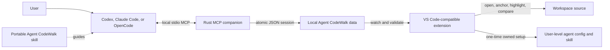

# Architecture

Agent CodeWalk is deliberately split into an editor extension, a local Rust MCP companion,
and a portable agent skill. No component can provide the product by itself: the agent
knows why code matters, the companion can measure what changed, and the editor can put the
explanation back on the source.

## System overview



There is no hosted Agent CodeWalk service. The extension registry is involved only when
the editor installs or updates the VSIX. Runtime publication and playback remain local.

## Components and ownership

| Component | Owns | Does not own |
| --- | --- | --- |
| Portable skill | When agents call publication tools and how they write steps | Diff calculation, persistence, or editor UI |
| Rust companion | Task baselines, Git change calculation, request validation, coverage, anchors, and atomic session publication | Editor navigation or rendering |
| Editor extension | Session discovery, strict TypeScript validation, navigation state, relocation, highlighting, CodeLens, diffs, webview, localization, and integration setup | Agent reasoning or Git baseline calculation |
| JSON Schema | Persisted walkthrough shape shared across Rust and TypeScript | Agent tool-call input schemas and UI state |

## Change walkthrough lifecycle

1. The skill tells the agent to call `begin_task` immediately before the first file
   mutation.
2. The companion resolves the canonical workspace. In a Git repository it uses the top
   level, even when the agent starts in a subdirectory.
3. The baseline records Git HEAD, index state, absent paths, and only the snapshots needed
   to distinguish pre-existing dirty or untracked content from this task.
4. The agent makes the requested change and verifies it normally.
5. The agent calls `publish_walkthrough` with a title, summary, and ordered source steps.
6. The companion recalculates the task diff. Each supported text hunk must overlap at
   least one resolved step; complete baselines reject publication while a hunk is
   uncovered.
7. Each step is enriched with a change kind, stable normalized SHA-256 anchor, hierarchy,
   dependency order, target availability, and bounded replaced text when a comparison is
   possible.
8. The companion validates file order and the acyclic sibling-level `flowAfter` graph,
   writes the complete session atomically, and removes the task baseline.
9. The extension's filesystem watcher notices the session. A slow poll covers filesystems
   that do not deliver reliable recursive watch events.
10. The TypeScript boundary validator rejects malformed or incompatible JSON before the
    player sees it. The latest valid session becomes available in the sidebar.

If an agent missed `begin_task`, it can publish without a task identifier. The companion
derives the best available baseline, marks the session `degradedBaseline`, and reports
uncovered hunks to the reader rather than presenting uncertain coverage as complete.

## Explanation walkthrough lifecycle

An analysis request uses `publish_explanation` directly. There is no baseline, Git diff,
coverage calculation, or replaced text because no task change is being described.

The companion still validates every step, path, range, hierarchy, and flow dependency.
Each leaf must point at code that exists now. The resulting session uses `kind:
"explanation"`, context highlights, empty change lists, and the same storage and playback
pipeline as a change walkthrough.

## Step hierarchy and execution flow

Steps express two independent relationships:

- `parentId` groups detailed steps under a higher-level idea. The hierarchy can be eight
  levels deep; the installed skill recommends two levels for readability.
- `flowAfter` says which sibling steps must be understood first because code or data flows
  from them. Dependencies cannot cross hierarchy levels, which keeps each graph layer
  coherent.

The companion derives two complete orders:

- **File order** sorts anchored blocks by file and position.
- **Flow order** performs a stable topological traversal of the validated dependency
  graph.

The extension graph displays the second relationship, while expansion and collapse follow
the first. Keyboard navigation moves through visible steps so a collapsed subtree is not
read accidentally; selecting a hidden step from CodeLens or search reveals its ancestors.

## Anchors and stale code

A step stores its original one-based line range, line count, and a SHA-256 hash of the
normalized block. Line endings are normalized so CRLF and LF do not create false staleness.

At playback:

1. The extension checks the original range.
2. If its hash still matches, the block opens there.
3. Otherwise the extension scans the same file for the normalized hash.
4. Exactly one match is treated as a safe relocation.
5. Zero or multiple matches produce a stale state and no active highlight.

The extension never chooses the nearest or first candidate. Failing visibly is safer than
attaching an explanation to unrelated code.

## Persisted protocol

`protocol/walkthrough-v1.schema.json` is the canonical persisted-session contract. Both
the Rust companion and TypeScript extension validate it independently, using shared
fixtures to prevent drift.

The most important top-level fields are:

| Field | Meaning |
| --- | --- |
| `schemaVersion` | Persisted contract version, currently `1` |
| `companionVersion` | Companion process that published the session, when known |
| `kind` | `change` or `explanation` |
| `workspaceFingerprint` | SHA-256 identity of the canonical workspace root |
| `steps` | Explanations, hierarchy, anchors, change kind, dependency edges, and optional replaced text |
| `fileOrder` / `flowOrder` | Validated complete navigation orders |
| `changedHunks` | Supported text changes derived from the baseline |
| `uncoveredHunks` | Unexplained changes, allowed only for a degraded baseline |
| `excludedChanges` | Unsupported changes retained with an actionable reason |
| `degradedBaseline` | Whether the task boundary is inferred rather than fully recorded |

Unknown fields are rejected. Additive optional fields are preferred for backward
compatibility while the version remains `1`; incompatible changes require coordinated
Rust, TypeScript, fixture, skill, test, and documentation updates.

## Workspace identity and storage

The companion and extension identify a workspace by hashing the canonical root path with
forward slashes. The extension checks both each open folder and its Git top level so an
agent started at the repository root and an editor opened on a subdirectory still meet.

The default data root is platform-specific:

| Platform | Default root |
| --- | --- |
| Linux | `$XDG_DATA_HOME/agent-codewalk` or `~/.local/share/agent-codewalk` |
| macOS | `~/Library/Application Support/agent-codewalk` |
| Windows | `%LOCALAPPDATA%\agent-codewalk` |

Within that root:

```text
agent-codewalk/
├── bin/<version>/agent-codewalk-mcp[.exe]
├── installation.json
├── transactions/...
└── workspaces/<workspace fingerprint>/
    ├── tasks/<task id>/...
    └── sessions/<walkthrough id>.json
```

`AGENT_CODEWALK_HOME` overrides the data root. The extension setting
`agentCodeWalk.storagePath` is the next precedence level, and
`AGENT_CODEWALK_WORKSPACE` can explicitly choose the companion workspace root.

## Agent integration setup

The VSIX contains the platform companion and one portable skill. The setup command detects
installed agents, previews its write plan, and then configures supported user-level paths:

| Agent | MCP configuration | Skill |
| --- | --- | --- |
| Codex | `~/.codex/config.toml` | `~/.agents/skills/agent-codewalk/` |
| Claude Code | `~/.claude.json` plus owned lifecycle hook in `~/.claude/settings.json` | `~/.claude/skills/agent-codewalk/` |
| OpenCode | preferred user `opencode.json` / `opencode.jsonc` | `~/.agents/skills/agent-codewalk/` |

Configuration edits are transactional. Existing files receive `.agent-codewalk.bak`
backups, an ownership marker is installed with each skill, and an unowned same-name entry
causes that agent to be skipped and rolled back. The installation manifest records the
resources that removal is allowed to consider.

Uninstall removes only owned skill directories, the installed companion, and configuration
entries that still point at that companion. It preserves unrelated agent settings and all
published walkthrough sessions.

## Trust boundaries

- MCP requests are untrusted input even when they came from an installed skill.
- Persisted session JSON is untrusted input when loaded by the extension.
- Agent-authored explanations are displayed as text, never trusted HTML.
- Webview messages are parsed into a closed union before they can invoke commands.
- Workspace paths are canonicalized and confined before reads or writes.
- Agent configuration outside the workspace is touched only after explicit confirmation
  and with ownership-aware rollback.
- MCP stdout is reserved for protocol transport; logs use stderr or a VS Code output
  channel.

See [SECURITY.md](../SECURITY.md) for reporting and the supported security boundary.

## Build and release shape

CI tests the extension on Linux and Rust on Linux, Windows, and macOS. A release tag builds
four platform VSIX files—Linux x64, Windows x64, macOS Intel, and macOS Apple silicon—from
the same source version. The workflow uploads them to GitHub Releases with checksums and
provenance, then publishes those artifacts to the Visual Studio Marketplace and Open VSX.

The extension and companion version must remain synchronized across the root package,
extension manifest, Cargo workspace, and installer constant. `scripts/sync-version.mjs`
updates or verifies those locations.

Operational details live in [publishing.md](publishing.md), and the full acceptance path is
in [release-checklist.md](release-checklist.md).
